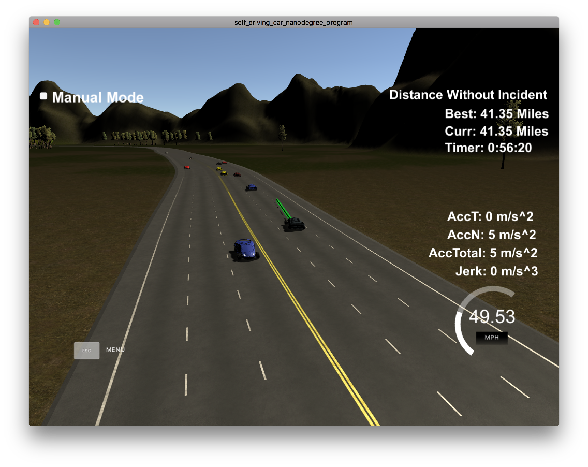

[](http://www.udacity.com/drive)

# Overview
The goal of this project is to safely navigate around a virtual highway with other traffic that is driving +-10 MPH of the 50 MPH speed limit. 
A path planner gets the localization of the car and sensor fusion data from a simulator. A map is available that lists the waypoints around the highway. 
The car should try to go as close as possible to the 50 MPH speed limit, which means passing slower traffic when possible. The car should avoid hitting other cars at all cost as well as driving inside of the marked road lanes at all times, unless going from one lane to another. The car should be able to make one complete loop around the 6946m highway. Since the car is trying to go 50 MPH, it should take a little over 5 minutes to complete 1 loop. Also the car should not experience total acceleration over 10 m/s^2 and jerk that is greater than 10 m/s^3.


The following image shows successful navigation around the virtual highway for more that 40 miles.


Safe lane changes are implemented as shown in the video.
[](https://www.youtube.com/watch?v=K8GEIQsaB_I)

# Files
The project consists of the following files:
* [README.md](https://github.com/MarkBroerkens/CarND-Path-Planning-Project/blob/master/README.md) (writeup report) documentation of the results 
* [main.cpp](https://github.com/MarkBroerkens/CarND-Path-Planning-Project/blob/master/src/main.cpp) The main c++ file that implements the communication with the simulator. 
* [path_planner.cpp](https://github.com/MarkBroerkens/CarND-Path-Planning-Project/blob/master/src/path_planner.cpp) The actual implementation of the path planner and the generation of the trajestories.
* [vehicle.cpp](https://github.com/MarkBroerkens/CarND-Path-Planning-Project/blob/master/src/vehicle.cpp) Class that represents the ego vehicle or other vehicle that are detected by sensor fusion. 
* [util.cpp](https://github.com/MarkBroerkens/CarND-Path-Planning-Project/blob/master/src/util.cpp) Utility functions

# Description of the Path Planner
The path planner is initialized by the main.cpp with the map of the highway.
Based on the data from the simulator, the path planner creates an instance of the ego vehicle and the surrounding vehicles based on information from sensor fusion.

## Behavior
The default behavior of the ego vehicle is to stay in its lane with the maximum speed (49.5 miles per hour). In case the prediction detects that the ego vehicle will get to close to a vehicle that is driving in front of the vehicle in the same lane, it has the following options (see PathPlanner::path()):
* slow down: if there is no faster lane or if it is not safe to change the lane 
* change lane: if a faster lane is detected and it is safe to change the lane

### Safety distance
The safe distance to a car that is driving in front of the ego vehicle is calculated in PathPlanner::safetyDistance based on the speed of the ego vehicle:

```cpp
double PathPlanner::safetyDistance(double speed_mps) {
  // see http://www.softschools.com/formulas/physics/stopping_distance_formula/89/
  double reaction_distance = speed_mps * REACTION_TIME_S;
  double brake_distance = (speed_mps * speed_mps)
      / (2 * CAR_COEFFICIENT_OF_FRICION * CAR_ACCELERATION_DUE_TO_GRAVITY_MPS2);
  return reaction_distance + brake_distance;
}
```

### Prediction
The prediction of the location of the ego vehicle is defined by the end of the previous path that was calculated in the previous iteration.

The prediction of the location of other vehicles that are driving in front of the vehicle is calcluated according to the follwing expression:

```cpp
check_car_s += ((double) prev_size * TICK_S * check_speed);
```

### Identification of the fastest lane
For each lane the minimum lane speed is calculated based on the cars that are visible in the range of the front sensor or up to 10 meters behind the ego vehicle. This helps avoiding collision with vehicles that are directly next to the ego vehicle.

```cpp
double PathPlanner::laneSpeed(int lane) {
  double lane_speed = milesPerHourToMetersPerSecond(MAX_SPEED_MPH);
  for (Vehicle vehicle : vehicles) {
    if (vehicle.lane == lane) {
      double distance_to_vehicle_ahead = wrappedDistance(ego.s, vehicle.s);
      double distance_to_vehicle_behind = wrappedDistance(vehicle.s, ego.s);
      if (((distance_to_vehicle_ahead < FRONT_SENSOR_RANGE_M) || (distance_to_vehicle_behind < 10))
          && (vehicle.speed < lane_speed)) {
        lane_speed = vehicle.speed;
      }
    }
  }
  return lane_speed;
}
```

Now we can iterate over all lanes and select identify the fastest lane. If several lanes allow the same speed, the lane that is closest to the ego vehicle is chosen. This helps avoiding unnecessary lane changes.

```cpp
int PathPlanner::fastestLane() {
  int fastest_lane = ego.lane;
  double fastest_speed = laneSpeed(fastest_lane);

  for (int lane = 0; lane < NUMBER_OF_LANES; lane++) {
    double lane_speed = laneSpeed(lane);
    if ((lane_speed > fastest_speed)
        || ((lane_speed == fastest_speed)
            && (fabs(lane - ego.lane) < fabs(fastest_lane - ego.lane)))) {
      fastest_speed = lane_speed;
      fastest_lane = lane;
    }
  }
  return fastest_lane;
}
```

### Safety
The behavior planner makes sure that the ego vehicle stays in its lane if a lane change is not safe. A lane change is considered safe if there is no other vehicle in the target lane within the safety distance of the ego vehicle in front and the safety distance of any vehicle in the target lane.

```cpp
double PathPlanner::safetyCosts(int lane) {
  // find vehicles in the lane that might cause trouble
  // cars in the safety distance before or behind us
  double safety_costs = 0.0;
  for (Vehicle vehicle : vehicles) {
    if (vehicle.lane == lane) {
      if ((wrappedDistance(vehicle.s, ego.s) < safetyDistance(vehicle.speed)) /* ego in front of vehicle */
          || (wrappedDistance(ego.s, vehicle.s) < safetyDistance(ego.speed)) /* ego vehicle in front of ego */) {
        safety_costs += 1.0;
      }
    }
  }
  return safety_costs;
}
```
 


### Calculation of distance when a new lap of the highway is started
The simulator restarts the driven distance of the track after TRACK_LENGTH_M meters. A helper function helps to calculate the distance even if the vehicles enter a new lap:

```cpp
double PathPlanner::wrappedDistance(double back_s, double front_s) {
  double distance = (front_s - back_s + TRACK_LENGTH_M) - TRACK_LENGTH_M;

  if (distance < 0) {
    distance = TRACK_LENGTH_M + distance;
  }
  return distance;
}
```

### Trajestory
A smooth trajestory is calculated using a spline that contains some previous path points of the ego vehicle and some future points from the map.  The actual future path points of the ego vehicle are derived from the spline. This helps to avoid jerk.

In order to avoid abrupt changes of the velocity, we incrementally increase or decrease the distance between the points of the path.


# Reflection
The implementation of the path planner work pretty well. However, it doesn't yet consider misbehaviour of other vehicles which could get to close to the ego vehicle. 

For future enhancements of the code I would continue the modularization into Behavior planner and trajestory planner. Especially, the implementation of a statechart for behavior planning and the evaluation of different behaviours and trajestories based on cost functions would improve the code of the path planner.


*the description below is Udacity's original README for the project repo*
   
### Simulator.
You can download the Term3 Simulator which contains the Path Planning Project from the [releases tab (https://github.com/udacity/self-driving-car-sim/releases/tag/T3_v1.2).

### Goals
In this project your goal is to safely navigate around a virtual highway with other traffic that is driving +-10 MPH of the 50 MPH speed limit. You will be provided the car's localization and sensor fusion data, there is also a sparse map list of waypoints around the highway. The car should try to go as close as possible to the 50 MPH speed limit, which means passing slower traffic when possible, note that other cars will try to change lanes too. The car should avoid hitting other cars at all cost as well as driving inside of the marked road lanes at all times, unless going from one lane to another. The car should be able to make one complete loop around the 6946m highway. Since the car is trying to go 50 MPH, it should take a little over 5 minutes to complete 1 loop. Also the car should not experience total acceleration over 10 m/s^2 and jerk that is greater than 10 m/s^3.

#### The map of the highway is in data/highway_map.txt
Each waypoint in the list contains  [x,y,s,dx,dy] values. x and y are the waypoint's map coordinate position, the s value is the distance along the road to get to that waypoint in meters, the dx and dy values define the unit normal vector pointing outward of the highway loop.

The highway's waypoints loop around so the frenet s value, distance along the road, goes from 0 to 6945.554.

## Basic Build Instructions

1. Clone this repo.
2. Make a build directory: `mkdir build && cd build`
3. Compile: `cmake .. && make`
4. Run it: `./path_planning`.

Here is the data provided from the Simulator to the C++ Program

#### Main car's localization Data (No Noise)

["x"] The car's x position in map coordinates

["y"] The car's y position in map coordinates

["s"] The car's s position in frenet coordinates

["d"] The car's d position in frenet coordinates

["yaw"] The car's yaw angle in the map

["speed"] The car's speed in MPH

#### Previous path data given to the Planner

//Note: Return the previous list but with processed points removed, can be a nice tool to show how far along
the path has processed since last time. 

["previous_path_x"] The previous list of x points previously given to the simulator

["previous_path_y"] The previous list of y points previously given to the simulator

#### Previous path's end s and d values 

["end_path_s"] The previous list's last point's frenet s value

["end_path_d"] The previous list's last point's frenet d value

#### Sensor Fusion Data, a list of all other car's attributes on the same side of the road. (No Noise)

["sensor_fusion"] A 2d vector of cars and then that car's [car's unique ID, car's x position in map coordinates, car's y position in map coordinates, car's x velocity in m/s, car's y velocity in m/s, car's s position in frenet coordinates, car's d position in frenet coordinates. 

## Details

1. The car uses a perfect controller and will visit every (x,y) point it recieves in the list every .02 seconds. The units for the (x,y) points are in meters and the spacing of the points determines the speed of the car. The vector going from a point to the next point in the list dictates the angle of the car. Acceleration both in the tangential and normal directions is measured along with the jerk, the rate of change of total Acceleration. The (x,y) point paths that the planner recieves should not have a total acceleration that goes over 10 m/s^2, also the jerk should not go over 50 m/s^3. (NOTE: As this is BETA, these requirements might change. Also currently jerk is over a .02 second interval, it would probably be better to average total acceleration over 1 second and measure jerk from that.

2. There will be some latency between the simulator running and the path planner returning a path, with optimized code usually its not very long maybe just 1-3 time steps. During this delay the simulator will continue using points that it was last given, because of this its a good idea to store the last points you have used so you can have a smooth transition. previous_path_x, and previous_path_y can be helpful for this transition since they show the last points given to the simulator controller with the processed points already removed. You would either return a path that extends this previous path or make sure to create a new path that has a smooth transition with this last path.

## Tips

A really helpful resource for doing this project and creating smooth trajectories was using http://kluge.in-chemnitz.de/opensource/spline/, the spline function is in a single hearder file is really easy to use.

---

## Dependencies

* cmake >= 3.5
  * All OSes: [click here for installation instructions](https://cmake.org/install/)
* make >= 4.1
  * Linux: make is installed by default on most Linux distros
  * Mac: [install Xcode command line tools to get make](https://developer.apple.com/xcode/features/)
  * Windows: [Click here for installation instructions](http://gnuwin32.sourceforge.net/packages/make.htm)
* gcc/g++ >= 5.4
  * Linux: gcc / g++ is installed by default on most Linux distros
  * Mac: same deal as make - [install Xcode command line tools]((https://developer.apple.com/xcode/features/)
  * Windows: recommend using [MinGW](http://www.mingw.org/)
* [uWebSockets](https://github.com/uWebSockets/uWebSockets)
  * Run either `install-mac.sh` or `install-ubuntu.sh`.
  * If you install from source, checkout to commit `e94b6e1`, i.e.
    ```
    git clone https://github.com/uWebSockets/uWebSockets 
    cd uWebSockets
    git checkout e94b6e1
    ```

## Editor Settings

We've purposefully kept editor configuration files out of this repo in order to
keep it as simple and environment agnostic as possible. However, we recommend
using the following settings:

* indent using spaces
* set tab width to 2 spaces (keeps the matrices in source code aligned)

## Code Style

Please (do your best to) stick to [Google's C++ style guide](https://google.github.io/styleguide/cppguide.html).

## Project Instructions and Rubric

Note: regardless of the changes you make, your project must be buildable using
cmake and make!


## Call for IDE Profiles Pull Requests

Help your fellow students!

We decided to create Makefiles with cmake to keep this project as platform
agnostic as possible. Similarly, we omitted IDE profiles in order to ensure
that students don't feel pressured to use one IDE or another.

However! I'd love to help people get up and running with their IDEs of choice.
If you've created a profile for an IDE that you think other students would
appreciate, we'd love to have you add the requisite profile files and
instructions to ide_profiles/. For example if you wanted to add a VS Code
profile, you'd add:

* /ide_profiles/vscode/.vscode
* /ide_profiles/vscode/README.md

The README should explain what the profile does, how to take advantage of it,
and how to install it.

Frankly, I've never been involved in a project with multiple IDE profiles
before. I believe the best way to handle this would be to keep them out of the
repo root to avoid clutter. My expectation is that most profiles will include
instructions to copy files to a new location to get picked up by the IDE, but
that's just a guess.

One last note here: regardless of the IDE used, every submitted project must
still be compilable with cmake and make./

## How to write a README
A well written README file can enhance your project and portfolio.  Develop your abilities to create professional README files by completing [this free course](https://www.udacity.com/course/writing-readmes--ud777).

